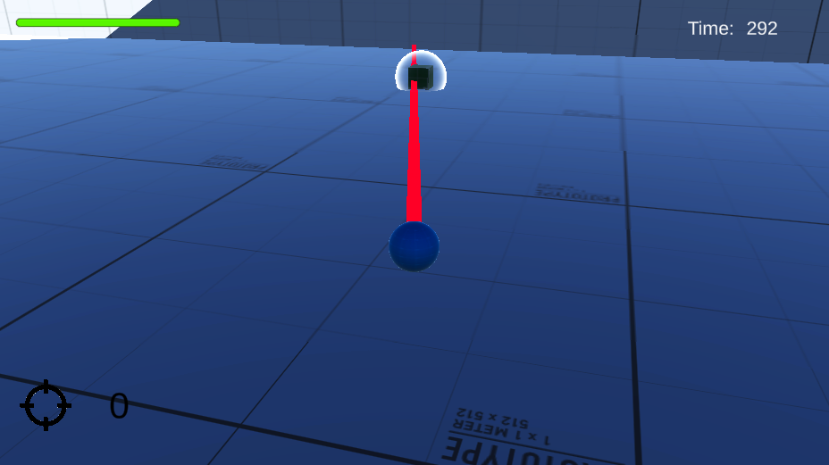
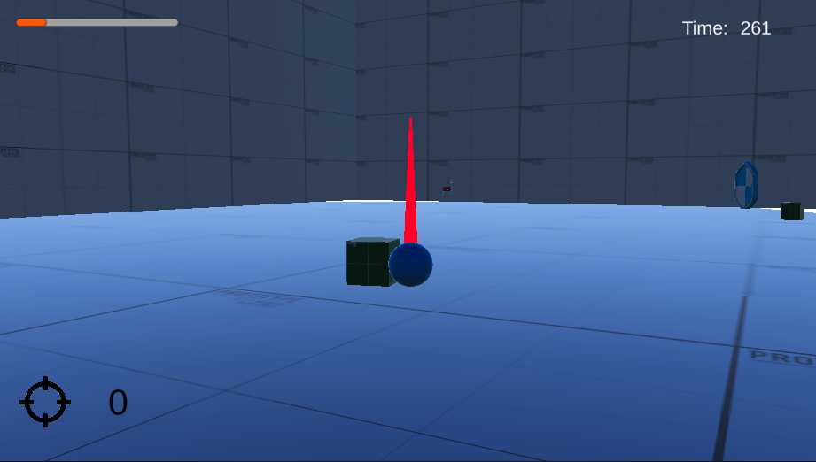
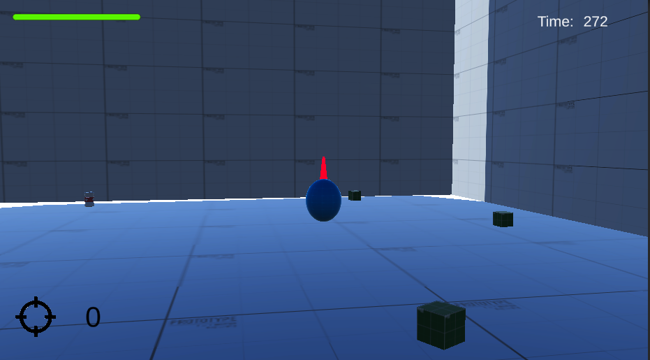
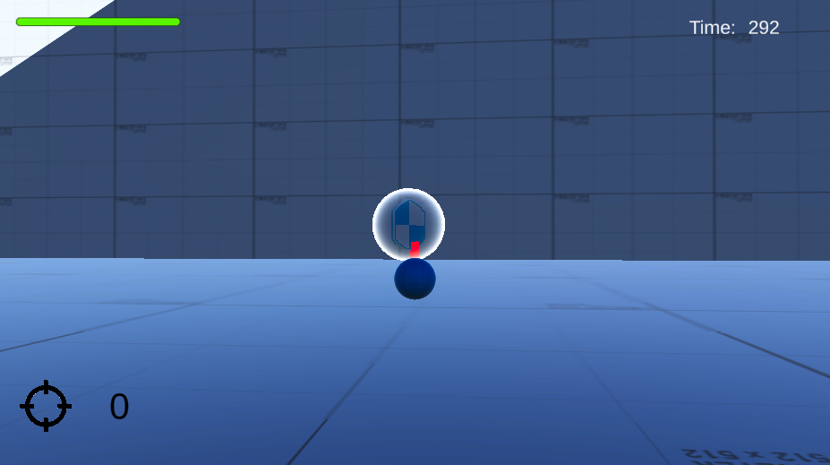
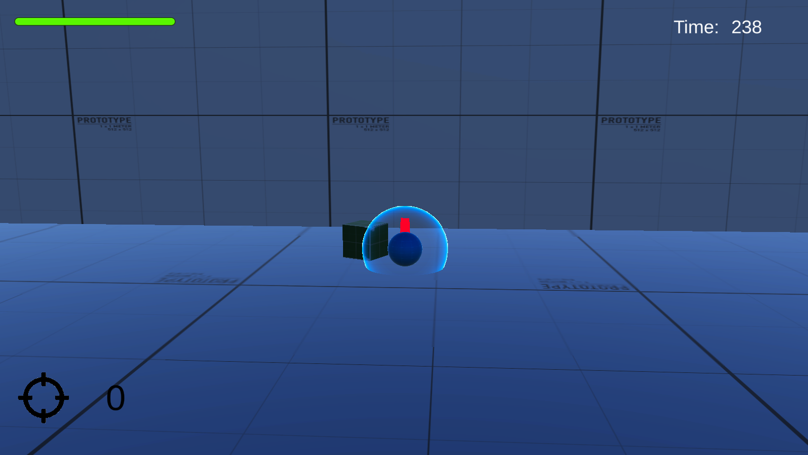
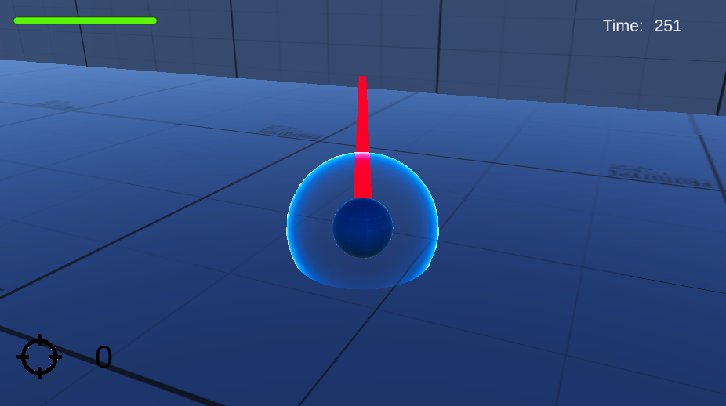

<h1>Minimalist</h1>

Minimalist is a game I developed around the theme of minimalism. The essence of the game requires the player to shoot enemies while a timer counts down. But, as the player uses more powerups, the times counts down faster. Therefore, the game rewards the player for being minimalist when it comes to using power ups!

<h3><strong>Important Note: </strong>All the coding scripts can be found in the Scripts folder located inside the Assets folder.</h3>

<h3>Programming Related Game Development Concepts Learned</h3>
<ul>
    <li>Enabling and disabling physics collision</li>
    <li>Interfacing with physics forces</li>
    <li>Combining UI with GameObjects to improve game play experience</li>
    <li>Organize logic into separate components to promote scalability and usability</li>
</ul>

<h3>Tools</h3>
<ul>
    <li>Game Engine: Unity</li>
    <li>Programming Language: C#</li>
    <li>3D-Modeling: Blender</li>
</ul>

<h3>Game Play Screenshots</h3>

<h3>How to use?</h3>

The Assets folder is the same Assets folder that comes with Unity. All the data, from textures to 3D models to C# scripts, have been organized in their own folders. Simply clone this repository and add the contents of the Assets folder to your Unity Project.
